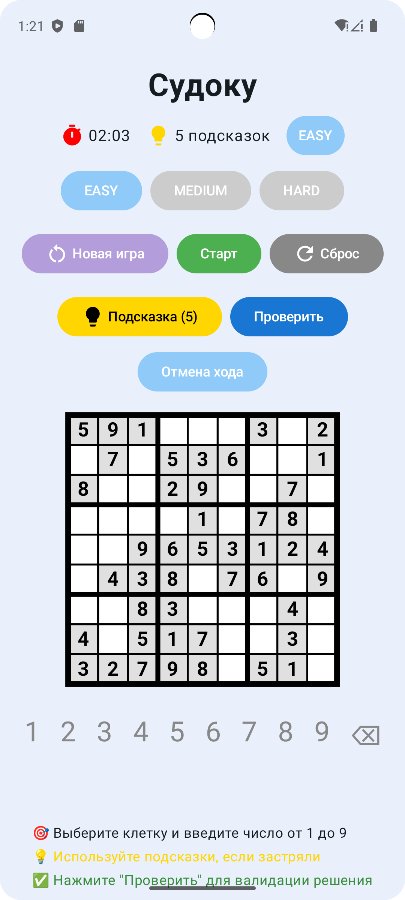

# SudokuGame

Современное Android-приложение-головоломка Судоку на Jetpack Compose

## Возможности

- Интерактивная доска 9×9 с подсветкой выбранной и связанных клеток
- Генерация уникальных судоку с тремя уровнями сложности (Легкий, Средний, Сложный)
- Проверка решения и подсветка ошибок в реальном времени
- Таймер с возможностью старта, паузы и сброса
- Ограниченное количество подсказок (по уровню сложности)
- Кнопка "Подсказка" — показывает правильное число в выбранной клетке
- Undo (отмена хода)
- Сохранение и восстановление прогресса
- Современный адаптивный дизайн, анимации, крупная цифровая панель

## Скриншот



## Как запустить

1. Открой проект в Android Studio (Arctic Fox и выше)
2. Убедись, что compileSdk = 35, minSdk = 31
3. Нажми Run (Shift+F10) — приложение запустится на эмуляторе или устройстве

## Структура каталогов

```
app/
└── src/
    └── main/
        └── java/
            └── com/example/sudokugame/
                ├── data/         # Уровни сложности
                ├── model/        # Бизнес-логика, генерация и проверка судоку
                ├── ui/           # Экраны, компоненты Compose (доска, панель, таймер, диалоги)
                ├── util/         # Утилиты (таймер)
                └── viewmodel/    # ViewModel, управление состоянием, таймер, подсказки
```

## Используемые технологии

- **Kotlin** — основной язык разработки
- **Jetpack Compose** — декларативный UI
- **MVVM** — архитектурный паттерн
- **Kotlin Coroutines, StateFlow** — реактивное управление состоянием
- **Material3, Material Icons** — современный дизайн и иконки
- **Android ViewModel** — управление жизненным циклом
- **SharedPreferences** — сохранение прогресса
- **Анимации Compose** — плавные переходы и отклики

## Автор

- Никита Заруба

---

**Удачной игры и новых рекордов!** 